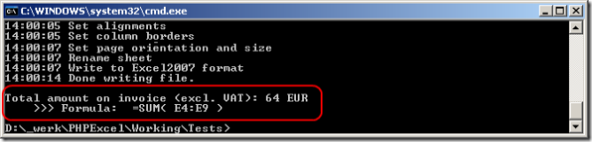
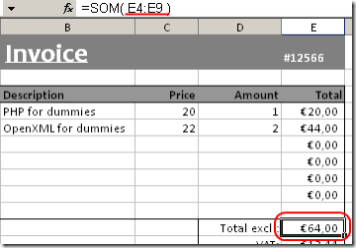
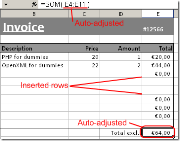

# Calculation Engine

## Using the PhpSpreadsheet calculation engine

### Performing formula calculations

As PhpSpreadsheet represents an in-memory spreadsheet, it also offers
formula calculation capabilities. A cell can be of a value type
(containing a number or text), or a formula type (containing a formula
which can be evaluated). For example, the formula `=SUM(A1:A10)`
evaluates to the sum of values in A1, A2, ..., A10.

To calculate a formula, you can call the cell containing the formula’s
method `getCalculatedValue()`, for example:

``` php
$spreadsheet->getActiveSheet()->getCell('E11')->getCalculatedValue();
```

If you write the following line of code in the invoice demo included
with PhpSpreadsheet, it evaluates to the value "64":



Another nice feature of PhpSpreadsheet's formula parser, is that it can
automatically adjust a formula when inserting/removing rows/columns.
Here's an example:



You see that the formula contained in cell E11 is "SUM(E4:E9)". Now,
when I write the following line of code, two new product lines are
added:

``` php
$spreadsheet->getActiveSheet()->insertNewRowBefore(7, 2);
```



Did you notice? The formula in the former cell E11 (now E13, as I
inserted 2 new rows), changed to "SUM(E4:E11)". Also, the inserted cells
duplicate style information of the previous cell, just like Excel's
behaviour. Note that you can both insert rows and columns.

## Known limitations

There are some known limitations to the PhpSpreadsheet calculation
engine. Most of them are due to the fact that an Excel formula is
converted into PHP code before being executed. This means that Excel
formula calculation is subject to PHP's language characteristics.

### Function that are not Supported in Xls

Not all functions are supported, for a comprehensive list, read the
[function list by name](../references/function-list-by-name.md).

#### Operator precedence

In Excel `+` wins over `&`, just like `*` wins over `+` in ordinary
algebra. The former rule is not what one finds using the calculation
engine shipped with PhpSpreadsheet.

- [Reference for Excel](https://support.office.com/en-us/article/Calculation-operators-and-precedence-in-Excel-48be406d-4975-4d31-b2b8-7af9e0e2878a)
- [Reference for PHP](https://php.net/manual/en/language.operators.php)

#### Formulas involving numbers and text

Formulas involving numbers and text may produce unexpected results or
even unreadable file contents. For example, the formula `=3+"Hello "` is
expected to produce an error in Excel (\#VALUE!). Due to the fact that
PHP converts `"Hello "` to a numeric value (zero), the result of this
formula is evaluated as 3 instead of evaluating as an error. This also
causes the Excel document being generated as containing unreadable
content.

- [Reference for this behaviour in PHP](https://php.net/manual/en/language.types.string.php#language.types.string.conversion)

#### Formulas don’t seem to be calculated in Excel2003 using compatibility pack?

This is normal behaviour of the compatibility pack, Xlsx displays this
correctly. Use `\PhpOffice\PhpSpreadsheet\Writer\Xls` if you really need
calculated values, or force recalculation in Excel2003.

## Handling Date and Time Values

### Excel functions that return a Date and Time value

Any of the Date and Time functions that return a date value in Excel can
return either an Excel timestamp or a PHP timestamp or `DateTime` object.

It is possible for scripts to change the data type used for returning
date values by calling the
`\PhpOffice\PhpSpreadsheet\Calculation\Functions::setReturnDateType()`
method:

``` php
\PhpOffice\PhpSpreadsheet\Calculation\Functions::setReturnDateType($returnDateType);
```

where the following constants can be used for `$returnDateType`:

- `\PhpOffice\PhpSpreadsheet\Calculation\Functions::RETURNDATE_PHP_NUMERIC`
- `\PhpOffice\PhpSpreadsheet\Calculation\Functions::RETURNDATE_PHP_OBJECT`
- `\PhpOffice\PhpSpreadsheet\Calculation\Functions::RETURNDATE_EXCEL`

The method will return a Boolean True on success, False on failure (e.g.
if an invalid value is passed in for the return date type).

The `\PhpOffice\PhpSpreadsheet\Calculation\Functions::getReturnDateType()`
method can be used to determine the current value of this setting:

``` php
$returnDateType = \PhpOffice\PhpSpreadsheet\Calculation\Functions::getReturnDateType();
```

The default is `RETURNDATE_PHP_NUMERIC`.

#### PHP Timestamps

If `RETURNDATE_PHP_NUMERIC` is set for the Return Date Type, then any
date value returned to the calling script by any access to the Date and
Time functions in Excel will be an integer value that represents the
number of seconds from the PHP/Unix base date. The PHP/Unix base date
(0) is 00:00 UST on 1st January 1970. This value can be positive or
negative: so a value of -3600 would be 23:00 hrs on 31st December 1969;
while a value of +3600 would be 01:00 hrs on 1st January 1970. This
gives PHP a date range of between 14th December 1901 and 19th January
2038.

#### PHP `DateTime` Objects

If the Return Date Type is set for `RETURNDATE_PHP_OBJECT`, then any
date value returned to the calling script by any access to the Date and
Time functions in Excel will be a PHP `DateTime` object.

#### Excel Timestamps

If `RETURNDATE_EXCEL` is set for the Return Date Type, then the returned
date value by any access to the Date and Time functions in Excel will be
a floating point value that represents a number of days from the Excel
base date. The Excel base date is determined by which calendar Excel
uses: the Windows 1900 or the Mac 1904 calendar. 1st January 1900 is the
base date for the Windows 1900 calendar while 1st January 1904 is the
base date for the Mac 1904 calendar.

It is possible for scripts to change the calendar used for calculating
Excel date values by calling the
`\PhpOffice\PhpSpreadsheet\Shared\Date::setExcelCalendar()` method:

``` php
\PhpOffice\PhpSpreadsheet\Shared\Date::setExcelCalendar($baseDate);
```

where the following constants can be used for `$baseDate`:

- `\PhpOffice\PhpSpreadsheet\Shared\Date::CALENDAR_WINDOWS_1900`
- `\PhpOffice\PhpSpreadsheet\Shared\Date::CALENDAR_MAC_1904`

The method will return a Boolean True on success, False on failure (e.g.
if an invalid value is passed in).

The `\PhpOffice\PhpSpreadsheet\Shared\Date::getExcelCalendar()` method can
be used to determine the current value of this setting:

``` php
$baseDate = \PhpOffice\PhpSpreadsheet\Shared\Date::getExcelCalendar();
```

The default is `CALENDAR_WINDOWS_1900`.

#### Functions that return a Date/Time Value

- DATE
- DATEVALUE
- EDATE
- EOMONTH
- NOW
- TIME
- TIMEVALUE
- TODAY

### Excel functions that accept Date and Time values as parameters

Date values passed in as parameters to a function can be an Excel
timestamp or a PHP timestamp; or `DateTime` object; or a string containing a
date value (e.g. '1-Jan-2009'). PhpSpreadsheet will attempt to identify
their type based on the PHP datatype:

An integer numeric value will be treated as a PHP/Unix timestamp. A real
(floating point) numeric value will be treated as an Excel
date/timestamp. Any PHP `DateTime` object will be treated as a `DateTime`
object. Any string value (even one containing straight numeric data)
will be converted to a `DateTime` object for validation as a date value
based on the server locale settings, so passing through an ambiguous
value of '07/08/2008' will be treated as 7th August 2008 if your server
settings are UK, but as 8th July 2008 if your server settings are US.
However, if you pass through a value such as '31/12/2008' that would be
considered an error by a US-based server, but which is not ambiguous,
then PhpSpreadsheet will attempt to correct this to 31st December 2008.
If the content of the string doesn’t match any of the formats recognised
by the php `DateTime` object implementation of `strtotime()` (which can
handle a wider range of formats than the normal `strtotime()` function),
then the function will return a `#VALUE` error. However, Excel
recommends that you should always use date/timestamps for your date
functions, and the recommendation for PhpSpreadsheet is the same: avoid
strings because the result is not predictable.

The same principle applies when data is being written to Excel. Cells
containing date actual values (rather than Excel functions that return a
date value) are always written as Excel dates, converting where
necessary. If a cell formatted as a date contains an integer or
`DateTime` object value, then it is converted to an Excel value for
writing: if a cell formatted as a date contains a real value, then no
conversion is required. Note that string values are written as strings
rather than converted to Excel date timestamp values.

#### Functions that expect a Date/Time Value

- DATEDIF
- DAY
- DAYS360
- EDATE
- EOMONTH
- HOUR
- MINUTE
- MONTH
- NETWORKDAYS
- SECOND
- WEEKDAY
- WEEKNUM
- WORKDAY
- YEAR
- YEARFRAC

### Helper Methods

In addition to the `setExcelCalendar()` and `getExcelCalendar()` methods, a
number of other methods are available in the
`\PhpOffice\PhpSpreadsheet\Shared\Date` class that can help when working
with dates:

#### \PhpOffice\PhpSpreadsheet\Shared\Date::excelToTimestamp($excelDate)

Converts a date/time from an Excel date timestamp to return a PHP
serialized date/timestamp.

Note that this method does not trap for Excel dates that fall outside of
the valid range for a PHP date timestamp.

#### \PhpOffice\PhpSpreadsheet\Shared\Date::excelToDateTimeObject($excelDate)

Converts a date from an Excel date/timestamp to return a PHP `DateTime`
object.

#### \PhpOffice\PhpSpreadsheet\Shared\Date::PHPToExcel($PHPDate)

Converts a PHP serialized date/timestamp or a PHP `DateTime` object to
return an Excel date timestamp.

#### \PhpOffice\PhpSpreadsheet\Shared\Date::formattedPHPToExcel($year, $month, $day, $hours=0, $minutes=0, $seconds=0)

Takes year, month and day values (and optional hour, minute and second
values) and returns an Excel date timestamp value.

### Timezone support for Excel date timestamp conversions

The default timezone for the date functions in PhpSpreadsheet is UST (Universal Standard Time).
If a different timezone needs to be used, these methods are available:

#### \PhpOffice\PhpSpreadsheet\Shared\Date::getDefaultTimezone()

Returns the current timezone value PhpSpeadsheet is using to handle dates and times.

#### \PhpOffice\PhpSpreadsheet\Shared\Date::setDefaultTimezone($timeZone)

Sets the timezone for Excel date timestamp conversions to $timeZone,
which must be a valid PHP DateTimeZone value.
The return value is a Boolean, where true is success,
and false is failure (e.g. an invalid DateTimeZone value was passed.)

#### \PhpOffice\PhpSpreadsheet\Shared\Date::excelToDateTimeObject($excelDate, $timeZone)
#### \PhpOffice\PhpSpreadsheet\Shared\Date::excelToTimeStamp($excelDate, $timeZone)

These functions support a timezone as an optional second parameter.
This applies a specific timezone to that function call without affecting the default PhpSpreadsheet Timezone.

## Function Reference

### Database Functions

#### DAVERAGE

The DAVERAGE function returns the average value of the cells in a column
of a list or database that match conditions you specify.

##### Syntax

    DAVERAGE (database, field, criteria)

##### Parameters

**database** The range of cells that makes up the list or database.

A database is a list of related data in which rows of related
information are records, and columns of data are fields. The first row
of the list contains labels for each column.

**field** Indicates which column of the database is used in the
function.

Enter the column label as a string (enclosed between double quotation
marks), such as "Age" or "Yield," or as a number (without quotation
marks) that represents the position of the column within the list: 1 for
the first column, 2 for the second column, and so on.

**criteria** The range of cells that contains the conditions you
specify.

You can use any range for the criteria argument, as long as it includes
at least one column label and at least one cell below the column label
in which you specify a condition for the column.

##### Return Value

**float** The average value of the matching cells.

This is the statistical mean.

##### Examples

``` php
$database = [
    [ 'Tree',  'Height', 'Age', 'Yield', 'Profit' ],
    [ 'Apple',  18,       20,    14,      105.00  ],
    [ 'Pear',   12,       12,    10,       96.00  ],
    [ 'Cherry', 13,       14,     9,      105.00  ],
    [ 'Apple',  14,       15,    10,       75.00  ],
    [ 'Pear',    9,        8,     8,       76.80  ],
    [ 'Apple',   8,        9,     6,       45.00  ],
];

$criteria = [
    [ 'Tree',      'Height', 'Age', 'Yield', 'Profit', 'Height' ],
    [ '="=Apple"', '>10',    NULL,  NULL,    NULL,     '<16'    ],
    [ '="=Pear"',  NULL,     NULL,  NULL,    NULL,     NULL     ],
];

$worksheet->fromArray( $criteria, NULL, 'A1' )
    ->fromArray( $database, NULL, 'A4' );

$worksheet->setCellValue('A12', '=DAVERAGE(A4:E10,"Yield",A1:B2)');

$retVal = $worksheet->getCell('A12')->getCalculatedValue();
// $retVal = 12
```

##### Notes

There are no additional notes on this function

#### DCOUNT

The DCOUNT function returns the count of cells that contain a number in
a column of a list or database matching conditions that you specify.

##### Syntax

    DCOUNT(database, [field], criteria)

##### Parameters

**database** The range of cells that makes up the list or database.

A database is a list of related data in which rows of related
information are records, and columns of data are fields. The first row
of the list contains labels for each column.

**field** Indicates which column of the database is used in the
function.

Enter the column label as a string (enclosed between double quotation
marks), such as "Age" or "Yield," or as a number (without quotation
marks) that represents the position of the column within the list: 1 for
the first column, 2 for the second column, and so on.

**criteria** The range of cells that contains the conditions you
specify.

You can use any range for the criteria argument, as long as it includes
at least one column label and at least one cell below the column label
in which you specify a condition for the column.

##### Return Value

**float** The count of the matching cells.

##### Examples

``` php
$database = [
    [ 'Tree',  'Height', 'Age', 'Yield', 'Profit' ],
    [ 'Apple',  18,       20,    14,      105.00  ],
    [ 'Pear',   12,       12,    10,       96.00  ],
    [ 'Cherry', 13,       14,     9,      105.00  ],
    [ 'Apple',  14,       15,    10,       75.00  ],
    [ 'Pear',    9,        8,     8,       76.80  ],
    [ 'Apple',   8,        9,     6,       45.00  ],
];

$criteria = [
    [ 'Tree',      'Height', 'Age', 'Yield', 'Profit', 'Height' ],
    [ '="=Apple"', '>10',    NULL,  NULL,    NULL,     '<16'    ],
    [ '="=Pear"',  NULL,     NULL,  NULL,    NULL,     NULL     ],
];

$worksheet->fromArray( $criteria, NULL, 'A1' )
    ->fromArray( $database, NULL, 'A4' );

$worksheet->setCellValue('A12', '=DCOUNT(A4:E10,"Height",A1:B3)');

$retVal = $worksheet->getCell('A12')->getCalculatedValu